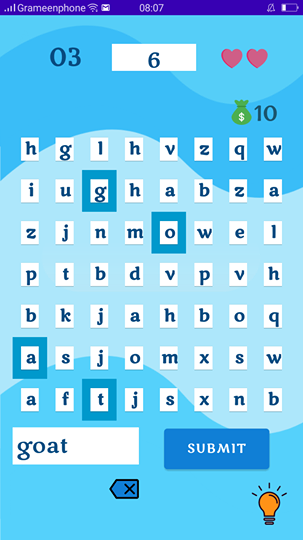

# Word-Hunt

## Introduction

This is a word making gaming app. Basically the player will be provided with a grid of random letters and s/he has to find a valid word from that grid. The project is written in Java using Android Studio.

## Starting

When the player opens the game, the app will start with a splash screen with a short animaton of 2 seconds showing the name of the game.  

## Menu
Then a menu will be opened where various options will be shown.  

### Silent Button
If the button is pressed, it will stop the background music and the button will be changed to volume button.  

### Volume Button
If the button is pressed, then again the background sound will start playing and the button will be changed to silent button.  

### Play New Game Button
This is the <i>Play</i> button to start a new game. 
 

### Resume Game Button
This is the <i>Resume</i> button to resume saved game. 
 

### Leaderboard Button
The button is to show the leaderboard. 
 

### Help Button
This is the button to show instructions. 
 

### Exit Button
This button is for exiting from the game. 
 

### Game Mode
This game has three modes: <i>Easy</i>, <i>Medium</i> and <i>Hard</i>. Each mode has different amount of time reserved for each level. 
| Mode        | Time allocated for each level (seconds) |
| ------------|:-----------------------------:|
| Easy        | 20                            | 
| Medium      | 15                            |  
| Hard        | 10                            |  

 

## Main Game 
Once the game is started, a screen with  a grid of random letters will appear. For each level, there will be random grid with random letters. At the upper portion of the screen, the time remaining for each level, the serial number of current level, total reamining lives and total score gained will be shown repectively. 
 

 The player has to make a valid word from the grid. S/he can make any word according to his or her wish, as the validity will be checked by <i>Oxford Dictionary</i> later on. The player's made word will be appeared in the text box located under the grid. 
 

 If the player makes a valid word, a window providing the definition of that word will be provided instantly. 
 

  The player will gain points according to the number of letters contained the player's mader word. For example, if he makes '<b>but</b>', then he will gain 3 points as there are three letters in the word. 
 

 If s/he fails to make any valid word within given time or makes an invalid word, then s/he will lose a life and a pop window will be opened for 3 seconds. 
 

  When there are 8 seconds remaining  to finish a level, the  <i>highlight</i> button will start blinking. If the player doesn't find any suggestion and wants to get some help, he can press the button, but he has to lose a life. 
 

  If the <i>highlight</i> button is pressed, some letters will be marked, from which a word can be made. 
 

 When there is only 5 seconds remaining to finish the level, a background sound of clock ticking will start and the clock starts blinking. 
 

  If the player accidentally presses any worng letter what he doesn't wish to, he can delete the last character by pressing the <i>back</i> button. 
 

 If the player presses the back button of mobile phone while the game is running, a pop up window will be opened. If the player chooses the <i>Resume</i> button, then the game will be resumed. If the <i>Main Menu</i> button is chosen, then the game will direct to the main menu. 
 

## LeaderBoard
If the <i>Leaderbord</i> button is pressed, then a leaderboard containing top 5 players will be shown which information will be retrieved from database. 
 

## Instruction Pages
If the <i>help</i> button is clicked, a detailed instruction will be provided.  
    
    
    
    
    
    
    
### Exit Confirmation
If the <i>Exit</i> button is pressed, then a confirmation window will be opened. If the player chooses <i>No</i> button, then the window will disappear. Otherwise, if the <i>Yes</i> button is chosen, then the app will close. 
 

## Last Few Words
This is a rough overview of the whole game. We tried our best to make the game interesting. We expect you will enjoy the game. Let's hope for the best. Assalamualaikum..
